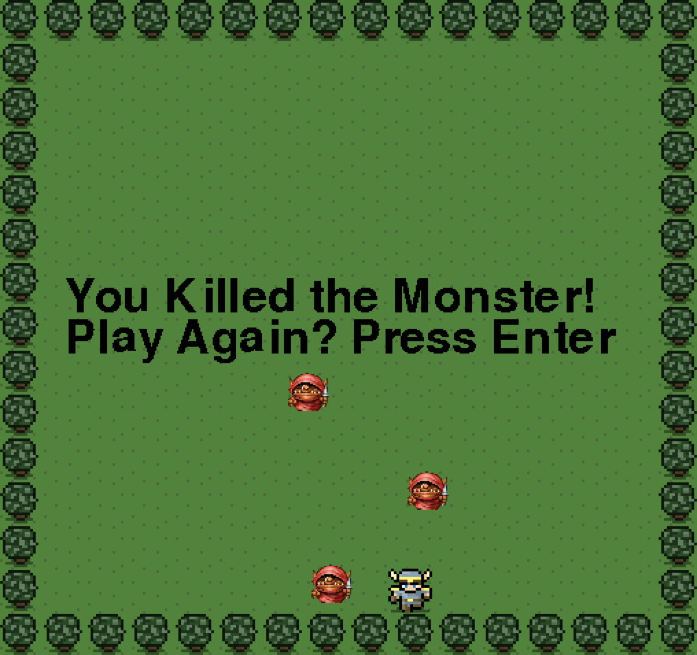

# Monster Mash Game!

A game in which the hero (you) is chasing the green monster (not you).
But make sure the goblins dont catch you.


Use the arrow keys to chase after the monster



After

### Prerequisites

you will need python3 and pygame installed on your system to run this game!

### Installing

A step by step series of examples that tell you have to get a development env running

Say what the step will be

```
Give the example
```

And repeat

```
until finished
```

End with an example of getting some data out of the system or using it for a little demo

## Running the tests

Explain how to run the automated tests for this system

### Break down into end to end tests

Explain what these tests test and why

```
Give an example
```

### And coding style tests

Explain what these tests test and why

```
Give an example
```

## Built With

* [Python 3](https://www.pygame.org/news) - Python programming language
* [Pygame](https://www.pygame.org/news) - Pythons game library

## Contributing

Feel free to grab a copy and make some contributions!


## Authors

* **Jesse Kent Weaver** - *Initial work* - [H0bbyist](https://github.com/H0bbyist)


